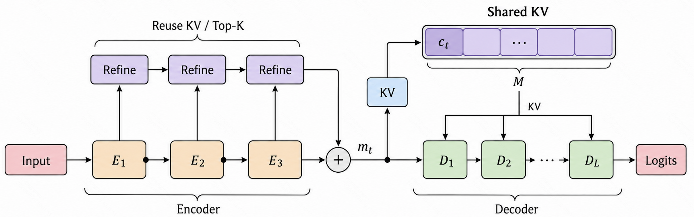
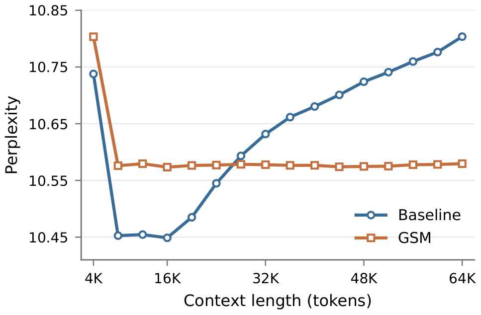
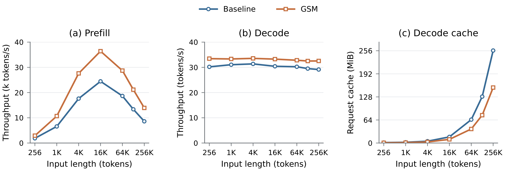

# GSM

# GSM: Global State Model

GSM is a causal encoder–decoder architecture for efficient long-context language modeling. It concentrates historical information selection and aggregation in the encoder, then supplies all decoder layers with a shared state of a fixed window size. This design reduces repeated retrieval and cache overhead across layers while preserving access to long-range information and sequential computation through decoder depth.

You can find the paper for this work [[Paper]](https://github.com/zyaaa-ux/GSM/blob/main/GSM_arxiv.pdf). The paper uses the ICLR template, but this does not imply that it has been submitted to ICLR.

## Architecture

The encoder performs multi-stage history reads to incorporate long-range information into each position's representation, reusing KV entries and Top-K selections. The accumulated history readout is fused with the encoder representation to construct shared KV states for the most recent M positions.

Each decoder layer reads the same shared state using its own evolving queries, without maintaining a separate historical KV cache or repeating long-range indexing. The fixed window makes the decoder's history-attention cost independent of the total context length.

## Long-Context Performance

In the reported evaluation, GSM maintains stable perplexity across context lengths from 8K to 64K and achieves lower perplexity than the baseline at 32K and beyond, demonstrating stable long-context modeling performance.

## Inference Efficiency

In the 1.5B model benchmark, GSM achieves higher prefill and decode throughput across all tested input lengths while reducing request-cache usage. The absolute gap in cache usage widens as the input length increases.
